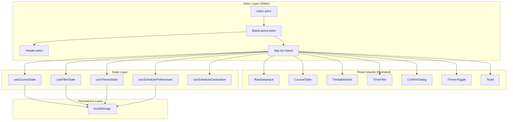
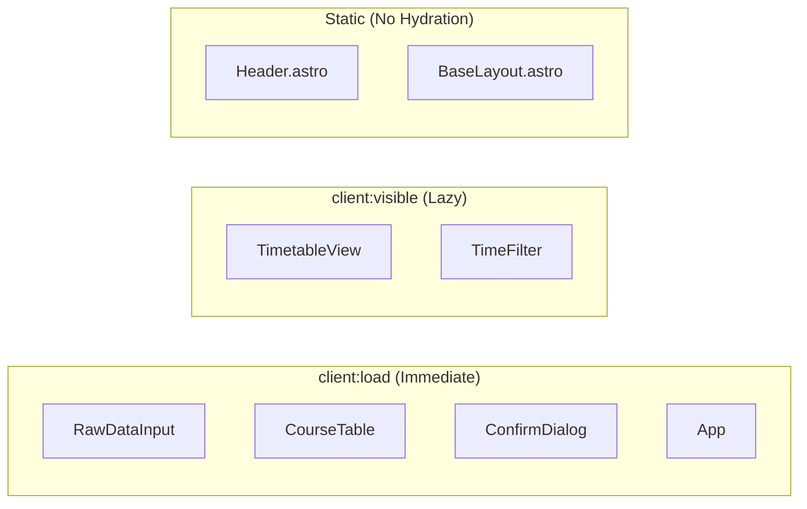
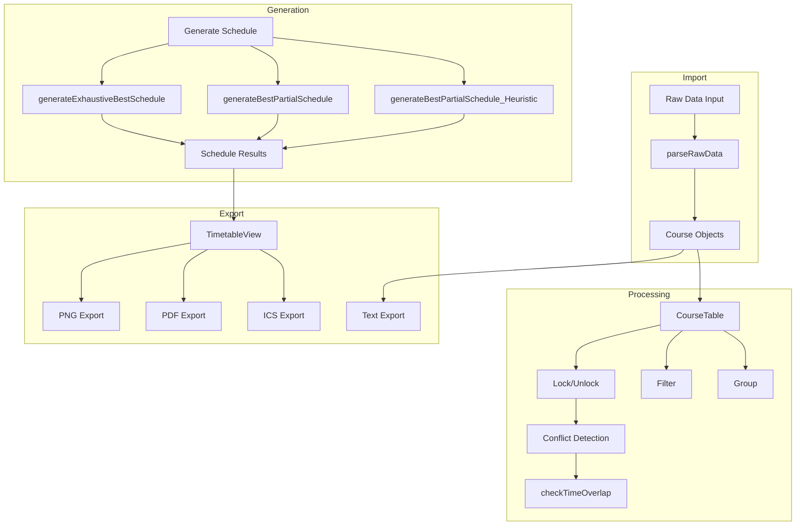
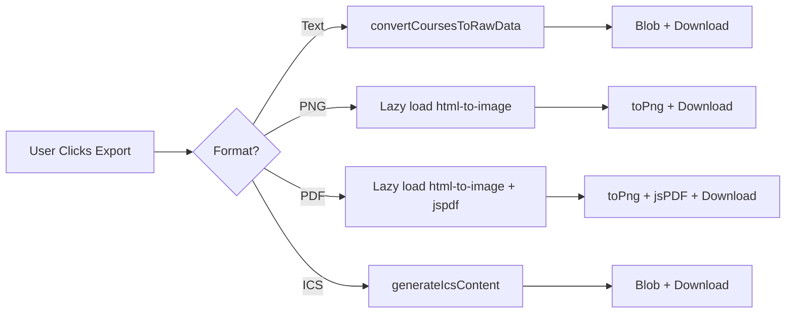
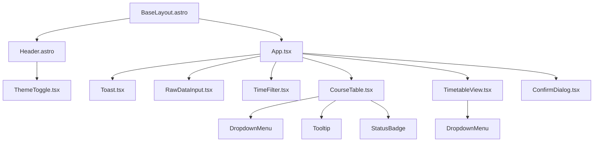
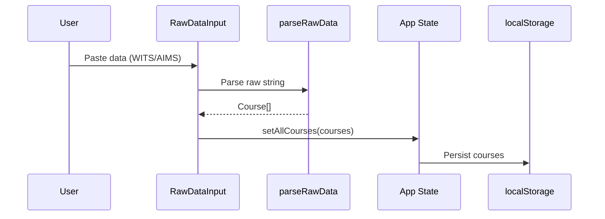
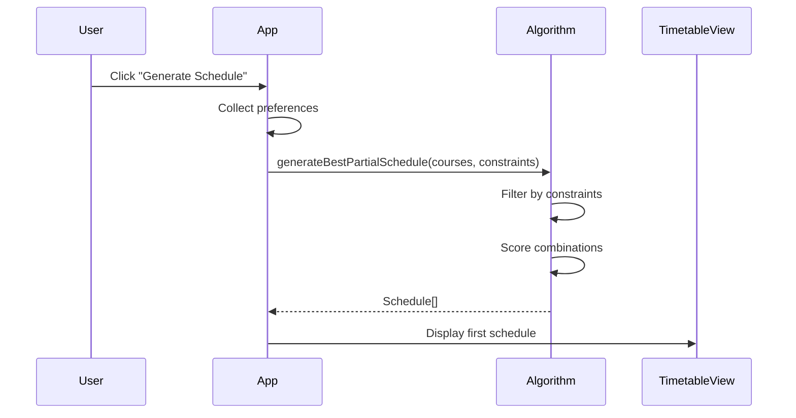
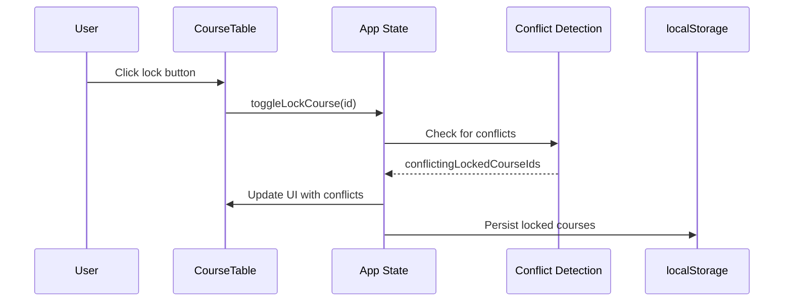

# CITU Course Builder Architecture Documentation

**Version:** 2.0  
**Last Updated:** 2026-02-19  
**Framework:** Astro 5.x with React 19.x Islands

---

## Table of Contents

1. [Overview](#overview)
2. [Architecture Diagram](#architecture-diagram)
3. [Astro + React Islands Architecture](#astro--react-islands-architecture)
4. [State Management](#state-management)
5. [Theme System](#theme-system)
6. [Export System](#export-system)
7. [Component Structure](#component-structure)
8. [Utility Functions](#utility-functions)
9. [Data Flow](#data-flow)
10. [References](#references)

---

## Overview

CITU Course Builder is a web application that helps students at Cebu Institute of Technology - University create optimal, conflict-free class schedules. The application was migrated from React 19 + Vite to Astro 5.x with React islands, achieving:

- **77% smaller main bundle** (117 KB vs 519 KB)
- **100 Lighthouse Performance score** (up from 75)
- **97 Lighthouse Accessibility score** (WCAG AA compliant)
- **Faster build times** (~5s vs ~4s for full build)

### Key Features

- Smart data import (WITS HTML, AIMS tab-separated formats)
- Course table with grouping, filtering, and locking
- Conflict detection and highlighting
- Schedule generation (exhaustive, heuristic, and random modes)
- Timetable visualization with export capabilities (PNG, PDF, ICS)
- Theme system with 6 combinations (light/dark × 3 palettes)

---

## Architecture Diagram

### High-Level Architecture



### Component Hydration Strategy



### Data Flow



---

## Astro + React Islands Architecture

### Overview

The application uses Astro's islands architecture, where most content is statically rendered at build time, and only interactive components (islands) are hydrated on the client.

### Benefits

| Aspect            | Before (React/Vite) | After (Astro + React Islands) |
| ----------------- | ------------------- | ----------------------------- |
| Main Bundle       | 519 KB              | 117 KB (77% reduction)        |
| Initial JS        | 1,070 KB            | ~164 KB (lazy-loaded)         |
| Build Time        | ~4s                 | ~5s                           |
| Performance Score | 75                  | 100                           |

### Hydration Directives

| Directive        | Behavior                         | Usage                           |
| ---------------- | -------------------------------- | ------------------------------- |
| `client:load`    | Hydrate immediately on page load | Critical interactive components |
| `client:visible` | Hydrate when entering viewport   | Heavy components below the fold |
| `client:idle`    | Hydrate during browser idle time | Non-critical components         |

### Component Hydration Map

| Component          | Directive        | Rationale                                                       |
| ------------------ | ---------------- | --------------------------------------------------------------- |
| `App.tsx`          | `client:load`    | Main application container                                      |
| `RawDataInput`     | `client:load`    | Critical for user input, must be interactive immediately        |
| `CourseTable`      | `client:load`    | Central feature, user interacts immediately                     |
| `ConfirmDialog`    | `client:load`    | May appear on initial interaction                               |
| `TimetableView`    | `client:visible` | Heavy component with export libraries (~140 KB gzip), lazy load |
| `TimeFilter`       | `client:visible` | Can wait until user scrolls to filter section                   |
| `ThemeToggle`      | `client:load`    | Theme flash prevention requires immediate interactivity         |
| `Header.astro`     | Static           | No interactivity needed                                         |
| `BaseLayout.astro` | Static           | Layout wrapper only                                             |

### File Structure

```
course-scheduler-astro/
├── src/
│   ├── components/           # React islands (.tsx)
│   │   ├── App.tsx
│   │   ├── RawDataInput.tsx
│   │   ├── CourseTable.tsx
│   │   ├── TimetableView.tsx
│   │   ├── TimeFilter.tsx
│   │   ├── ConfirmDialog.tsx
│   │   ├── ThemeToggle.tsx
│   │   └── Toast.tsx
│   ├── layouts/              # Astro layouts (.astro)
│   │   └── BaseLayout.astro
│   ├── pages/                # Astro pages (.astro)
│   │   └── index.astro
│   ├── styles/               # Global styles
│   │   └── global.css
│   ├── utils/                # Utility functions (.ts)
│   │   ├── parseSchedule.ts
│   │   ├── parseRawData.ts
│   │   ├── generateIcs.ts
│   │   ├── convertToRawData.ts
│   │   └── scheduleAlgorithms.ts
│   ├── hooks/                # Custom React hooks (.ts)
│   │   ├── useLocalStorage.ts
│   │   ├── useCourseState.ts
│   │   ├── useFilterState.ts
│   │   ├── useThemeState.ts
│   │   ├── useSchedulePreferences.ts
│   │   └── useScheduleGeneration.ts
│   ├── types/                # TypeScript interfaces
│   │   └── index.ts
│   └── algorithms/           # Algorithm exports
│       └── scheduleGeneration.ts
├── public/                   # Static assets
└── tests/                    # Test files
```

**Detailed documentation:** [REACT_ISLANDS_HYDRATION.md](./REACT_ISLANDS_HYDRATION.md)

---

## State Management

### Overview

The application uses React's built-in state management (useState, useReducer) within React islands, with localStorage for persistence. This approach was chosen over external state libraries (Zustand, Jotai, Nanostores) because:

1. State is entirely client-side (no SSR considerations)
2. Flat component architecture means no complex prop drilling
3. localStorage persistence is straightforward
4. Zero additional bundle size

### State Categories

```
┌─────────────────────────────────────────────────────────────────────────────┐
│                          State Categories                                    │
├─────────────────────────────────────────────────────────────────────────────┤
│  Persisted State (localStorage)          │  Transient State (memory only)   │
│  ─────────────────────────────────────── │  ──────────────────────────────  │
��  • allCourses (Course[])                 │  • conflictingLockedCourseIds    │
│  • excludedDays (string[])               │  • showTimetable                 │
│  • excludedTimeRanges (TimeRange[])      │  • generatedScheduleCount        │
│  • theme ('light' | 'dark')              │  • generatedSchedules            │
│  • themePalette ({light, dark})          │  • currentScheduleIndex          │
│  • groupingKey (string)                  │  • isGenerating                  │
│  • selectedSectionTypes (string[])       │  • confirmDialog                 │
│  • selectedStatusFilter (string)         │  • rawData                       │
│  • maxUnits (string)                     │                                  │
│  • maxClassGapHours (string)             │                                  │
│  • preferredTimeOfDayOrder (string[])    │                                  │
│  • scheduleSearchMode (string)           │                                  │
│  • minimizeDaysOnCampus (boolean)        │                                  │
└─────────────────────────────────────────────────────────────────────────────┘
```

### Custom Hooks

| Hook                     | Purpose                                                   | State Count |
| ------------------------ | --------------------------------------------------------- | ----------- |
| `useLocalStorage`        | Generic localStorage persistence with validation          | -           |
| `useCourseState`         | Courses, grouping, filtering, locking, conflict detection | 5           |
| `useFilterState`         | Day/time exclusion filters                                | 4           |
| `useThemeState`          | Theme/palette state with DOM sync                         | 2           |
| `useSchedulePreferences` | Time preference, search mode, minimize days               | 3           |
| `useScheduleGeneration`  | Transient state for schedule generation                   | 5           |

### localStorage Keys

| Key                                  | Type                | Default                               |
| ------------------------------------ | ------------------- | ------------------------------------- |
| `courseBuilder_allCourses`           | `Course[]`          | `[]`                                  |
| `courseBuilder_excludedDays`         | `string[]`          | `[]`                                  |
| `courseBuilder_excludedTimeRanges`   | `TimeRange[]`       | `[]`                                  |
| `courseBuilder_theme`                | `'light' \| 'dark'` | `'dark'`                              |
| `courseBuilder_themePalette`         | `{light, dark}`     | `{original, original}`                |
| `courseBuilder_groupingKey`          | `string`            | `'subject'`                           |
| `courseBuilder_selectedSectionTypes` | `string[]`          | `[]`                                  |
| `courseBuilder_selectedStatusFilter` | `string`            | `'open'`                              |
| `courseBuilder_maxUnits`             | `string`            | `''`                                  |
| `courseBuilder_maxClassGapHours`     | `string`            | `''`                                  |
| `courseBuilder_preferredTimeOfDay`   | `string[]`          | `['morning', 'afternoon', 'evening']` |
| `courseBuilder_scheduleSearchMode`   | `string`            | `'partial'`                           |
| `courseBuilder_minimizeDaysOnCampus` | `boolean`           | `false`                               |

**Detailed documentation:** [ADR-003: State Management Approach](./decisions/ADR-003-state-management-approach.md)

---

## Theme System

### Overview

The application supports 6 theme combinations through CSS custom properties and data attributes. Themes are applied via `data-theme` (light/dark) and `data-palette` (original/comfort/space) attributes on `document.documentElement`.

### Theme Combination Matrix

| Theme | Palette  | Background | Accent    | Use Case                  |
| ----- | -------- | ---------- | --------- | ------------------------- |
| Light | Original | `#f8fafc`  | `#4f46e5` | Standard light theme      |
| Light | Comfort  | `#C5D5EA`  | `#0855b1` | Blue-tinted, softer       |
| Light | Space    | `#ffffff`  | `#2a9d8f` | Teal accent, warm palette |
| Dark  | Original | `#0f172a`  | `#6366f1` | Standard dark theme       |
| Dark  | Comfort  | `#121212`  | `#888888` | Muted, grayscale          |
| Dark  | Space    | `#1a1a1a`  | `#2a9d8f` | Teal accent, gold text    |

### Semantic Color System

The theme system uses semantic color tokens that map to specific values per theme/palette:

| Token          | Purpose         | Light Value | Dark Value |
| -------------- | --------------- | ----------- | ---------- |
| `--bg-color`   | Main background | `#f8fafc`   | `#0f172a`  |
| `--text-color` | Primary text    | `#1e293b`   | `#f1f5f9`  |
| `--accent`     | Primary accent  | `#4f46e5`   | `#6366f1`  |
| `--success`    | Success states  | `#16a34a`   | `#22c55e`  |
| `--warning`    | Warning states  | `#ca8a04`   | `#eab308`  |
| `--danger`     | Danger states   | `#dc2626`   | `#ef4444`  |

### Theme Flash Prevention

To prevent theme flash on page load, an inline script runs before React hydrates:

```astro
<script is:inline>
  const theme = localStorage.getItem('courseBuilder_theme') || 'dark';
  const palette = JSON.parse(
    localStorage.getItem('courseBuilder_themePalette') || '{"light":"original","dark":"original"}'
  );
  document.documentElement.setAttribute('data-theme', theme);
  document.documentElement.setAttribute('data-palette', palette[theme]);
</script>
```

### Subject Color Coding

The timetable uses 12 playful subject colors for visual differentiation:

| Index | Light Theme         | Dark Theme |
| ----- | ------------------- | ---------- |
| 1     | `#ef4444` (red)     | `#f87171`  |
| 2     | `#f97316` (orange)  | `#fb923c`  |
| 3     | `#eab308` (yellow)  | `#facc15`  |
| 4     | `#22c55e` (green)   | `#4ade80`  |
| 5     | `#14b8a6` (teal)    | `#2dd4bf`  |
| 6     | `#06b6d4` (cyan)    | `#22d3ee`  |
| 7     | `#3b82f6` (blue)    | `#60a5fa`  |
| 8     | `#8b5cf6` (violet)  | `#a78bfa`  |
| 9     | `#d946ef` (fuchsia) | `#e879f9`  |
| 10    | `#ec4899` (pink)    | `#f472b6`  |
| 11    | `#6366f1` (indigo)  | `#818cf8`  |
| 12    | `#a855f7` (purple)  | `#c084fc`  |

**Detailed documentation:** [CSS_ARCHITECTURE.md](./CSS_ARCHITECTURE.md), [COLOR_CONTRAST_REPORT.md](./COLOR_CONTRAST_REPORT.md)

---

## Export System

### Overview

The application supports four export formats for different use cases:

| Format          | Use Case                    | Implementation                      |
| --------------- | --------------------------- | ----------------------------------- |
| **Text (.txt)** | Course list for sharing     | `convertCoursesToRawData()`         |
| **PNG**         | Visual timetable screenshot | `html-to-image` library             |
| **PDF**         | Print-friendly timetable    | `html-to-image` + `jspdf` libraries |
| **ICS**         | Calendar import             | `generateIcsContent()`              |

### Export Flow



### Text Export

Converts courses to tab-separated format (AIMS-compatible):

```typescript
// Format: id, offeringDept, subject, subjectTitle, creditedUnits, section,
//         schedule, room, totalSlots, enrolled, assessed, isClosed
const fields = [
  course.id,
  course.offeringDept,
  course.subject,
  course.subjectTitle,
  course.creditedUnits?.toString() || '0',
  course.section,
  course.schedule,
  course.room,
  course.totalSlots?.toString() || '0',
  course.enrolled?.toString() || '0',
  course.assessed?.toString() || '0',
  course.isClosed ? 'yes' : 'no',
];
```

### PNG Export

Uses `html-to-image` to capture the timetable DOM element:

```typescript
const { toPng } = await import('html-to-image');

const options = {
  cacheBust: true,
  quality: 1,
  skipFonts: true,
  filter: (node) => node.nodeName !== 'SCRIPT',
};

const dataUrl = await toPng(timetableRef.current, options);
// Create download link
```

### PDF Export

Combines `html-to-image` with `jspdf` for print-ready output:

```typescript
const [{ toPng }, { default: jsPDF }] = await Promise.all([
  import('html-to-image'),
  import('jspdf'),
]);

// Capture timetable as PNG
const dataUrl = await toPng(timetableRef.current, options);

// Create PDF with timetable image
const pdf = new jsPDF({
  orientation: img.width > img.height ? 'landscape' : 'portrait',
  unit: 'px',
  format: [img.width + 40, img.height + 60],
});

pdf.setFontSize(16);
pdf.text('CITU Course Schedule', 20, 30);
pdf.addImage(dataUrl, 'PNG', 20, 60, img.width, img.height);
pdf.save('timetable_export.pdf');
```

### ICS Export

Generates iCalendar format for calendar import:

```typescript
// ICS Structure
BEGIN:VCALENDAR
VERSION:2.0
PRODID:-//CITU Course Builder//NONSGML Timetable//EN
CALSCALE:GREGORIAN
METHOD:PUBLISH
X-WR-CALNAME:CITU Timetable Export
BEGIN:VEVENT
UID:1708123456789-0-BSIT-1A-0900-M@citucoursebuilder.com
DTSTAMP:20260219T120000Z
DTSTART:20260217T090000
DTEND:20260217T103000
SUMMARY:IT 111 - Introduction to Computing
LOCATION:Room 101
DESCRIPTION:Section: BSIT-1A...
RRULE:FREQ=WEEKLY;BYDAY=MO,WE,FR;COUNT=16
END:VEVENT
END:VCALENDAR
```

### Lazy Loading

Export libraries are lazy-loaded to reduce initial bundle size:

| Library         | Size (gzip) | Loading Strategy               |
| --------------- | ----------- | ------------------------------ |
| `html-to-image` | ~40 KB      | Dynamic import on export click |
| `jspdf`         | ~100 KB     | Dynamic import on export click |
| Combined        | ~140 KB     | Only loaded when exporting     |

**Utility files:** `src/utils/convertToRawData.ts`, `src/utils/generateIcs.ts`

---

## Component Structure

### Component Hierarchy



### Component Props

| Component       | Key Props                                           | Description                         |
| --------------- | --------------------------------------------------- | ----------------------------------- |
| `App`           | -                                                   | Main container with all state hooks |
| `RawDataInput`  | `value`, `onChange`, `onSubmit`                     | Data import interface               |
| `CourseTable`   | `courses`, `groupingKey`, `onLock`, `onDelete`      | Course list display                 |
| `TimetableView` | `lockedCourses`, `onExport*`                        | Timetable grid visualization        |
| `TimeFilter`    | `excludedDays`, `excludedTimeRanges`, `onChange`    | Filter controls                     |
| `ConfirmDialog` | `open`, `title`, `message`, `onConfirm`, `onCancel` | Confirmation modal                  |

**Detailed documentation:** [COMPONENT_DEPENDENCY_GRAPH.md](./COMPONENT_DEPENDENCY_GRAPH.md)

---

## Utility Functions

### Core Utilities

| File                    | Purpose                         | Lines |
| ----------------------- | ------------------------------- | ----- |
| `parseSchedule.ts`      | Schedule string parsing         | ~470  |
| `parseRawData.ts`       | Course data parsing (WITS/AIMS) | ~400  |
| `generateIcs.ts`        | ICS calendar generation         | ~135  |
| `convertToRawData.ts`   | Course data export              | ~65   |
| `scheduleAlgorithms.ts` | Schedule generation algorithms  | ~640  |

### Scheduling Algorithms

| Function                                | Purpose                                     |
| --------------------------------------- | ------------------------------------------- |
| `checkTimeOverlap`                      | Check if two time ranges overlap            |
| `isScheduleConflictFree`                | Verify schedule has no conflicts            |
| `getTimeOfDayBucket`                    | Categorize time (morning/afternoon/evening) |
| `scoreScheduleByTimePreference`         | Score schedule by time preferences          |
| `exceedsMaxUnits`                       | Check if exceeds unit limit                 |
| `exceedsMaxGap`                         | Check if gaps exceed threshold              |
| `countCampusDays`                       | Count unique on-campus days                 |
| `generateExhaustiveBestSchedule`        | Exhaustive search algorithm                 |
| `getAllSubsets`                         | Generate power set                          |
| `generateBestPartialSchedule_Heuristic` | Heuristic-based generator                   |
| `generateBestPartialSchedule`           | Main partial schedule entry point           |

### Generation Modes

| Mode                      | Algorithm                | Best For                                 |
| ------------------------- | ------------------------ | ---------------------------------------- |
| **Exhaustive**            | Tries all combinations   | Small course sets (≤12), optimal results |
| **Partial (Recommended)** | Heuristic for large sets | Large course sets, maximizes subjects    |
| **Fast**                  | Random sampling          | Quick results, may miss optimal          |

**Detailed documentation:** [SCHEDULING_ALGORITHMS.md](./SCHEDULING_ALGORITHMS.md)

---

## Data Flow

### Import Flow



### Schedule Generation Flow



### Locking Flow



---

## References

### Architecture Decision Records

- [ADR-001: Framework Migration Approach](./decisions/ADR-001-framework-migration-approach.md)
- [ADR-002: UI Component Strategy](./decisions/ADR-002-ui-component-strategy.md)
- [ADR-003: State Management Approach](./decisions/ADR-003-state-management-approach.md)

### Detailed Documentation

- [React Islands Hydration](./REACT_ISLANDS_HYDRATION.md)
- [Component Dependency Graph](./COMPONENT_DEPENDENCY_GRAPH.md)
- [App State Analysis](./APP_STATE_ANALYSIS.md)
- [CSS Architecture](./CSS_ARCHITECTURE.md)
- [Scheduling Algorithms](./SCHEDULING_ALGORITHMS.md)
- [Performance Baseline](./PERFORMANCE_BASELINE.md)
- [Test Coverage Baseline](./TEST_COVERAGE_BASELINE.md)
- [Bundle Analysis](./BUNDLE_ANALYSIS.md)
- [Color Contrast Report](./COLOR_CONTRAST_REPORT.md)

### External Resources

- [Astro Islands Architecture](https://docs.astro.build/en/concepts/islands/)
- [Astro + React Integration](https://docs.astro.build/en/guides/integrations-guide/react/)
- [Tailwind CSS v4](https://tailwindcss.com/docs)
- [html-to-image](https://github.com/bubkoo/html-to-image)
- [jsPDF](https://github.com/parallax/jsPDF)

---

_Generated for T6.1.2 - Create architecture documentation_
