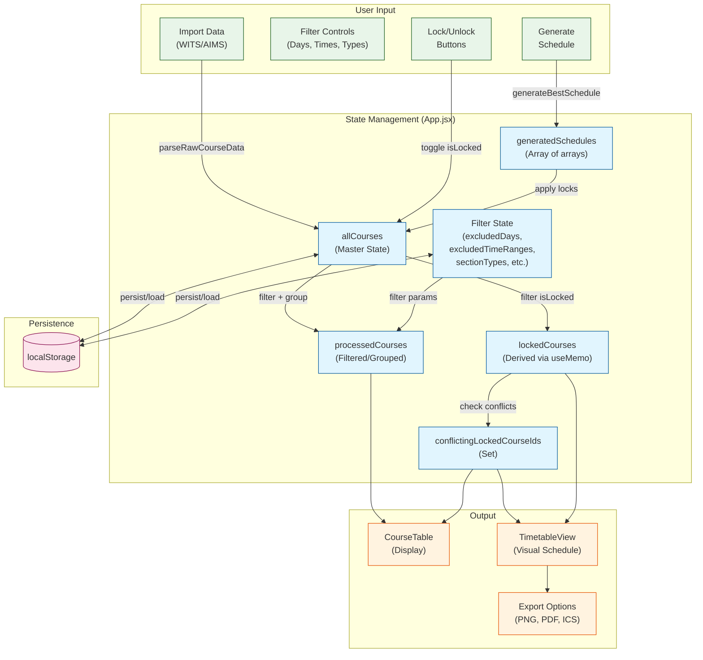
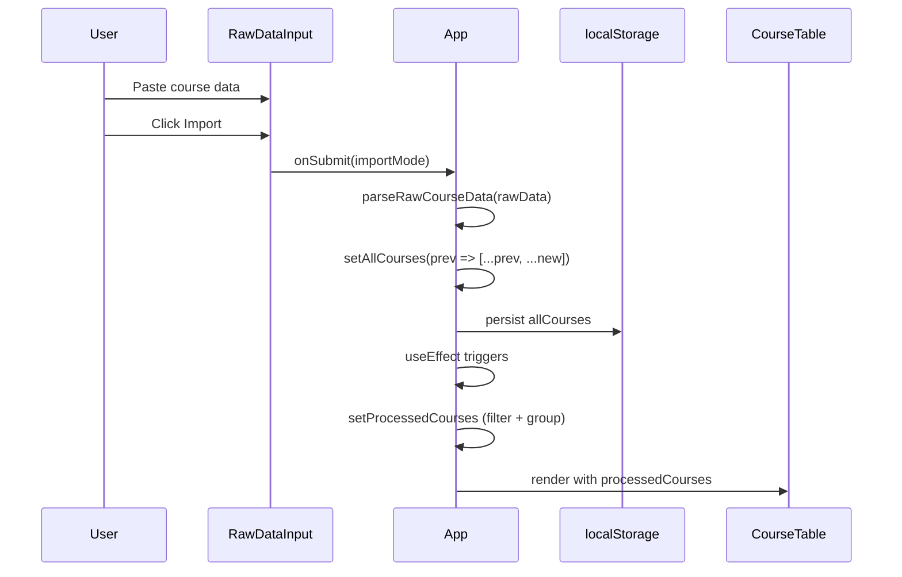
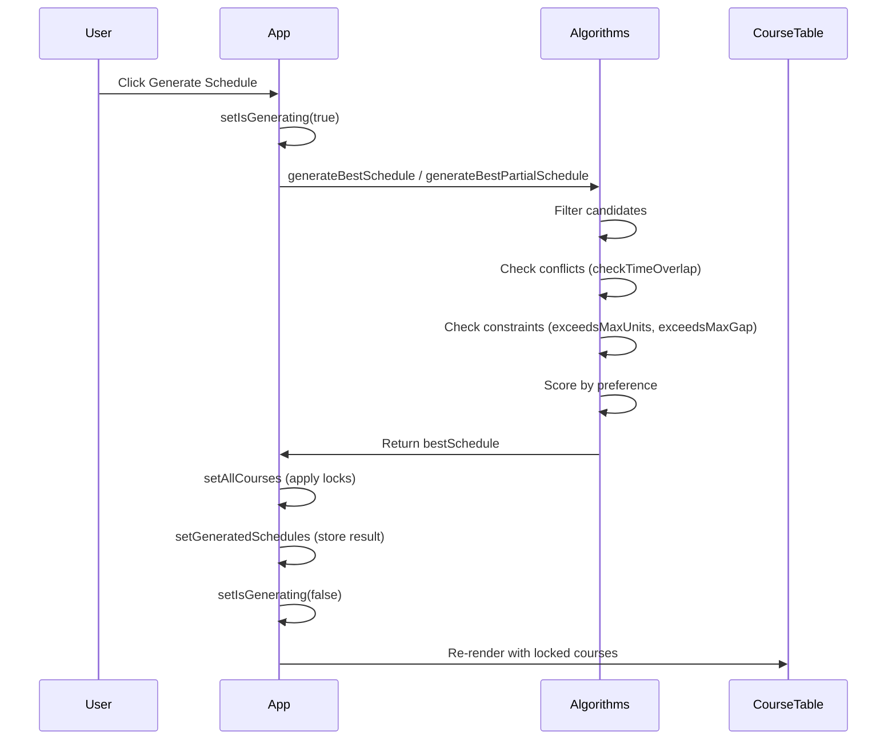

# Component Dependency Graph

**Generated:** 2026-02-17
**Task:** T1.1.1 - Analyze App.jsx component structure and extract state management patterns

---

## Component Dependency Graph (Mermaid)

```mermaid
graph TD
    subgraph "External Libraries"
        MUI["@mui/material"]
        MUIIcons["@mui/icons-material"]
        Toastify["react-toastify"]
        DatePicker["react-datepicker"]
        HtmlToImage["html-to-image"]
        JsPDF["jspdf"]
    end

    subgraph "Utilities"
        ParseSchedule["parseSchedule.js"]
        ParseRawData["parseRawData.js"]
        GenerateIcs["generateIcs.js"]
        ConvertToRawData["convertToRawData.js"]
    end

    subgraph "Components"
        App["App.jsx"]
        TimeFilter["TimeFilter.jsx"]
        CourseTable["CourseTable.jsx"]
        TimetableView["TimetableView.jsx"]
        RawDataInput["RawDataInput.jsx"]
        ConfirmDialog["ConfirmDialog.jsx"]
    end

    %% App dependencies
    App --> MUI
    App --> MUIIcons
    App --> Toastify
    App --> ParseSchedule
    App --> ParseRawData
    App --> TimeFilter
    App --> CourseTable
    App --> TimetableView
    App --> RawDataInput
    App --> ConfirmDialog

    %% TimeFilter dependencies
    TimeFilter --> DatePicker

    %% CourseTable dependencies
    CourseTable --> MUI
    CourseTable --> MUIIcons
    CourseTable --> Toastify
    CourseTable --> ConvertToRawData

    %% TimetableView dependencies
    TimetableView --> MUI
    TimetableView --> MUIIcons
    TimetableView --> Toastify
    TimetableView --> HtmlToImage
    TimetableView --> JsPDF
    TimetableView --> GenerateIcs
    TimetableView --> ParseSchedule

    %% ConfirmDialog dependencies
    ConfirmDialog --> MUI
    ConfirmDialog --> MUIIcons

    %% RawDataInput - minimal dependencies
    RawDataInput --> PropTypes["prop-types"]
```



---

## Data Flow Diagram (Mermaid)



---

## State Update Flow



---

## Schedule Generation Flow



---

## Component Coupling Analysis

| Component     | Coupled To                                       | Coupling Level | Notes                          |
| ------------- | ------------------------------------------------ | -------------- | ------------------------------ |
| App.jsx       | All components                                   | High           | Root component, owns all state |
| TimeFilter    | react-datepicker                                 | Low            | Single external dependency     |
| CourseTable   | MUI, Toastify, convertToRawData                  | Medium         | Export functionality           |
| TimetableView | MUI, Toastify, html-to-image, jspdf, generateIcs | High           | Export dependencies            |
| RawDataInput  | prop-types                                       | Low            | Minimal, pure component        |
| ConfirmDialog | MUI                                              | Low            | Self-contained modal           |

---

## Import Graph (File Level)

```
App.jsx
├── @mui/icons-material (InfoOutlinedIcon, PaletteOutlinedIcon)
├── @mui/material (Tooltip)
├── react (useEffect, useMemo, useRef, useState)
├── react-toastify (toast, ToastContainer)
├── ./App.css
├── ./assets/logo_icon_*.svg
├── ./components/ConfirmDialog
├── ./components/CourseTable
├── ./components/RawDataInput
├── ./components/TimeFilter
├── ./components/TimetableView
├── ./utils/parseRawData (parseRawCourseData)
└── ./utils/parseSchedule (parseSchedule)

TimeFilter.jsx
├── react
├── react-datepicker
└── react-datepicker/dist/react-datepicker.css

CourseTable.jsx
├── @mui/icons-material (InfoOutlinedIcon, MenuIcon)
├── @mui/material (IconButton, Menu, MenuItem, Tooltip)
├── react (Fragment, useMemo, useState)
├── react-toastify (toast)
├── ../App.css
└── ../utils/convertToRawData (convertCoursesToRawData)

TimetableView.jsx
├── @mui/icons-material (MenuIcon)
├── @mui/material (IconButton, Menu, MenuItem, Tooltip)
├── html-to-image (toPng)
├── jspdf (jsPDF)
├── react (useRef, useState)
├── react-toastify (toast)
├── ../utils/generateIcs (generateIcsContent)
└── ../utils/parseSchedule (parseSchedule)

RawDataInput.jsx
├── prop-types
└── react (useState)

ConfirmDialog.jsx
├── @mui/icons-material (InfoOutlinedIcon, WarningAmberIcon)
├── @mui/material (Button, Dialog, DialogActions, DialogContent, DialogContentText, DialogTitle)
└── react
```

---

## Recommendations for Migration

1. **Reduce MUI Dependencies**: Replace MUI components with Tailwind-styled equivalents
2. **Extract State Hooks**: Create custom hooks to reduce App.jsx complexity
3. **Keep Utilities Pure**: parseSchedule.js, parseRawData.js, generateIcs.js, convertToRawData.js should remain unchanged
4. **Consider Zustand/Jotai**: If state management becomes more complex, but current architecture is simple enough for React-only
