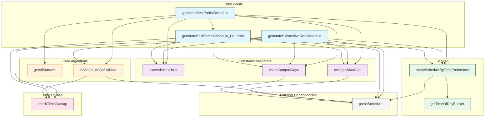
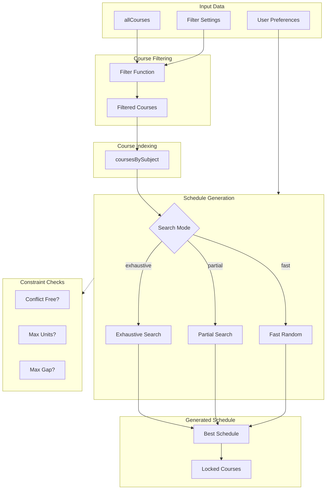

# Scheduling Algorithms Analysis & TypeScript Interfaces

**Generated:** 2026-02-17
**Task:** T1.1.2 - Catalog all scheduling algorithms and their dependencies

---

## 1. Algorithm Functions Inventory

### 1.1 Core Utility Functions

| Function | Location (App.jsx) | Lines | Purpose |
|----------|-------------------|-------|---------|
| `loadFromLocalStorage` | 42-114 | ~72 | Load persisted state from localStorage with validation |
| `getSectionTypeSuffix` | 116-121 | ~5 | Extract section type (AP3/AP4/AP5) from section string |

### 1.2 Time & Schedule Analysis Functions

| Function | Location (App.jsx) | Lines | Purpose |
|----------|-------------------|-------|---------|
| `checkTimeOverlap` | 123-129 | ~6 | Check if two time ranges overlap |
| `isScheduleConflictFree` | 131-162 | ~31 | Verify a schedule has no internal conflicts |
| `getTimeOfDayBucket` | 164-171 | ~7 | Categorize time as morning/afternoon/evening/any |
| `scoreScheduleByTimePreference` | 173-188 | ~15 | Score schedule based on time preferences |

### 1.3 Constraint Validation Functions

| Function | Location (App.jsx) | Lines | Purpose |
|----------|-------------------|-------|---------|
| `exceedsMaxUnits` | 190-197 | ~7 | Check if schedule exceeds maximum unit limit |
| `exceedsMaxGap` | 199-229 | ~30 | Check if schedule has gaps exceeding threshold |
| `countCampusDays` | 231-247 | ~16 | Count unique on-campus days in schedule |

### 1.4 Schedule Generation Algorithms

| Function | Location (App.jsx) | Lines | Purpose |
|----------|-------------------|-------|---------|
| `generateExhaustiveBestSchedule` | 250-333 | ~83 | Exhaustive search for optimal schedule |
| `getAllSubsets` | 335-344 | ~9 | Generate all subsets of an array (power set) |
| `generateBestPartialSchedule_Heuristic` | 347-468 | ~121 | Heuristic-based partial schedule generator |
| `generateBestPartialSchedule` | 471-535 | ~64 | Main partial schedule entry point |

**Total Algorithm Code:** ~461 lines (including loadFromLocalStorage)

---

## 2. TypeScript Interface Definitions

### 2.1 Core Data Types

```typescript
/**
 * Day codes used in schedule strings
 * - M = Monday
 * - T = Tuesday
 * - W = Wednesday
 * - TH = Thursday
 * - F = Friday
 * - S = Saturday
 * - SU = Sunday
 */
export type DayCode = 'M' | 'T' | 'W' | 'TH' | 'F' | 'S' | 'SU';

/**
 * Time of day bucket for preference scoring
 */
export type TimeOfDayBucket = 'morning' | 'afternoon' | 'evening' | 'any';

/**
 * Schedule search mode
 * - 'partial': Heuristic-based, maximizes subjects even if not all fit
 * - 'exhaustive': Tries all combinations, fails if can't fit all subjects
 * - 'fast': Random sampling, may miss optimal schedules
 */
export type ScheduleSearchMode = 'partial' | 'exhaustive' | 'fast';

/**
 * Grouping mode for course display
 */
export type GroupingMode = 'none' | 'subject' | 'offeringDept';

/**
 * Status filter for courses
 */
export type StatusFilter = 'all' | 'open' | 'closed';

/**
 * Theme mode
 */
export type ThemeMode = 'light' | 'dark';

/**
 * Color palette options
 */
export type ColorPalette = 'original' | 'comfort' | 'space';
```

### 2.2 Time Slot Types

```typescript
/**
 * Represents a single time slot in a parsed schedule
 */
export interface TimeSlot {
  /** Array of day codes for this slot */
  days: DayCode[];
  /** Start time in HH:mm format (24-hour) */
  startTime: string | null;
  /** End time in HH:mm format (24-hour) */
  endTime: string | null;
  /** Room/location for this slot */
  room?: string;
}

/**
 * Result of parsing a schedule string
 * Can represent TBA schedules, single slots, or multi-slot schedules
 */
export interface ParsedSchedule {
  /** All time slots extracted from the schedule */
  allTimeSlots: TimeSlot[];
  /** Representative days (union of all slot days) */
  representativeDays: DayCode[];
  /** Whether this is a TBA (To Be Announced) schedule */
  isTBA: boolean;
  /** Original schedule string */
  rawScheduleString?: string;
  // Backward compatibility properties (first slot)
  days: DayCode[];
  startTime: string | null;
  endTime: string | null;
}

/**
 * Discriminated union for schedule types
 */
export type ScheduleType = 
  | { type: 'tba' }
  | { type: 'single'; slot: TimeSlot }
  | { type: 'multi'; slots: TimeSlot[] };
```

### 2.3 Course Types

```typescript
/**
 * Unique identifier for a course (compound key)
 */
export interface CourseIdentity {
  id: string;
  subject: string;
  section: string;
}

/**
 * Represents a single course offering
 */
export interface Course extends CourseIdentity {
  /** Full title of the subject */
  subjectTitle: string;
  /** Raw schedule string (e.g., "TTH | 9:00AM-10:30AM | ROOM") */
  schedule: string;
  /** Room/location */
  room: string;
  /** Number of units */
  units: string;
  /** Credited units (may differ from enrolled units) */
  creditedUnits?: string;
  /** Whether this course is locked in the schedule */
  isLocked: boolean;
  /** Whether this course section is closed */
  isClosed: boolean;
  /** Number of enrolled students */
  enrolled: number;
  /** Number of assessed students */
  assessed: number;
  /** Total available slots */
  totalSlots: number;
  /** Available (remaining) slots */
  availableSlots: number;
  /** Department offering the course */
  offeringDept?: string;
}

/**
 * Grouped courses for display
 */
export interface GroupedCourse {
  /** Value to group by (subject name, department, etc.) */
  groupValue: string;
  /** Courses in this group */
  courses: Course[];
}

/**
 * Courses indexed by subject
 */
export type CoursesBySubject = Record<string, Course[]>;
```

### 2.4 Filter & Preference Types

```typescript
/**
 * Time range for exclusion filtering
 */
export interface TimeRange {
  /** Unique identifier for this range */
  id: number;
  /** Start time in HH:mm format */
  start: string;
  /** End time in HH:mm format */
  end: string;
}

/**
 * Filter state for course filtering
 */
export interface FilterState {
  /** Days to exclude from schedules */
  excludedDays: DayCode[];
  /** Time ranges to exclude */
  excludedTimeRanges: TimeRange[];
  /** Section types to filter (AP3, AP4, AP5) */
  selectedSectionTypes: string[];
  /** Status filter (all/open/closed) */
  selectedStatusFilter: StatusFilter;
  /** Grouping mode for display */
  groupingKey: GroupingMode;
}

/**
 * User preferences for schedule generation
 */
export interface SchedulePreferences {
  /** Maximum allowed units per schedule */
  maxUnits: string;
  /** Maximum gap between classes in hours */
  maxGapHours: string;
  /** Preferred time ordering for scoring */
  preferredTimeOfDayOrder: TimeOfDayBucket[];
  /** Schedule search algorithm mode */
  scheduleSearchMode: ScheduleSearchMode;
  /** Whether to minimize campus days */
  minimizeDaysOnCampus: boolean;
}
```

### 2.5 Schedule Generation Types

```typescript
/**
 * Result of schedule generation
 */
export interface ScheduleGenerationResult {
  /** Best schedule found */
  bestSchedule: Course[];
  /** Score based on courses + units */
  bestScore: number;
  /** Time preference score (lower is better) */
  bestTimePrefScore: number;
  /** Number of unique campus days */
  bestCampusDays: number;
}

/**
 * Options for schedule generation algorithms
 */
export interface ScheduleAlgorithmOptions {
  /** Courses grouped by subject */
  coursesBySubject: CoursesBySubject;
  /** Preferred time ordering */
  preferredTimeOfDayOrder: TimeOfDayBucket[];
  /** Maximum units constraint */
  maxUnits: string;
  /** Maximum gap hours constraint */
  maxGapHours: string;
  /** Whether to minimize campus days */
  minimizeDaysOnCampus: boolean;
}

/**
 * Internal state for heuristic algorithm
 */
export interface HeuristicState {
  currentSchedule: Course[];
  currentSubjectsSet: Set<string>;
  poolOfCandidates: Course[];
}
```

### 2.6 State Types

```typescript
/**
 * Theme palette state
 */
export interface ThemePaletteState {
  light: ColorPalette;
  dark: ColorPalette;
}

/**
 * Dialog configuration
 */
export interface DialogState {
  open: boolean;
  title: string;
  message: string;
  onConfirm: (() => void) | null;
  onCancel: (() => void) | null;
  confirmText: string;
  cancelText: string;
}

/**
 * Complete application state
 */
export interface AppState {
  // Core Data
  allCourses: Course[];
  processedCourses: Course[] | GroupedCourse[];
  rawData: string;
  
  // Theme
  theme: ThemeMode;
  themePalette: ThemePaletteState;
  
  // Filters
  filterState: FilterState;
  
  // Preferences
  preferences: SchedulePreferences;
  
  // UI State
  conflictingLockedCourseIds: Set<string>;
  showTimetable: boolean;
  generatedScheduleCount: number;
  generatedSchedules: string[][];
  currentScheduleIndex: number;
  isGenerating: boolean;
  confirmDialog: DialogState;
}
```

---

## 3. Function Signatures with TypeScript

### 3.1 LocalStorage Functions

```typescript
/**
 * Loads a value from localStorage with validation
 * @param key - localStorage key to read
 * @param defaultValue - Default value if key not found or invalid
 * @returns The parsed and validated value, or defaultValue
 */
function loadFromLocalStorage<T>(
  key: string, 
  defaultValue: T
): T;

/**
 * Extracts the section type suffix from a section string
 * @param sectionString - Section identifier (e.g., "BSIT-1A-AP3")
 * @returns Section type suffix ("AP3", "AP4", "AP5") or null
 */
function getSectionTypeSuffix(
  sectionString: string | undefined
): 'AP3' | 'AP4' | 'AP5' | null;
```

### 3.2 Time & Conflict Detection Functions

```typescript
/**
 * Checks if two time ranges overlap
 * @param start1 - Start time of first range (HH:mm)
 * @param end1 - End time of first range (HH:mm)
 * @param start2 - Start time of second range (HH:mm)
 * @param end2 - End time of second range (HH:mm)
 * @returns true if ranges overlap, false otherwise
 */
function checkTimeOverlap(
  start1: string, 
  end1: string, 
  start2: string, 
  end2: string
): boolean;

/**
 * Checks if a schedule has no internal time conflicts
 * @param scheduleToTest - Array of courses to check
 * @param parseFn - Function to parse schedule strings
 * @param overlapFn - Function to check time overlap
 * @returns true if no conflicts, false if conflicts exist
 */
function isScheduleConflictFree(
  scheduleToTest: Course[],
  parseFn: (schedule: string) => ParsedSchedule | null,
  overlapFn: (s1: string, e1: string, s2: string, e2: string) => boolean
): boolean;

/**
 * Categorizes a time into a time-of-day bucket
 * @param time - Time string in HH:mm format
 * @returns Time bucket category
 */
function getTimeOfDayBucket(
  time: string | null | undefined
): TimeOfDayBucket;
```

### 3.3 Scoring & Validation Functions

```typescript
/**
 * Scores a schedule based on time preferences
 * Lower score = better match to preferences
 * @param schedule - Array of courses to score
 * @param prefOrder - Ordered preference array
 * @returns Score (lower is better)
 */
function scoreScheduleByTimePreference(
  schedule: Course[],
  prefOrder: TimeOfDayBucket[]
): number;

/**
 * Checks if a schedule exceeds maximum units
 * @param schedule - Array of courses to check
 * @param maxUnits - Maximum allowed units (empty string = no limit)
 * @returns true if exceeds limit, false otherwise
 */
function exceedsMaxUnits(
  schedule: Course[],
  maxUnits: string
): boolean;

/**
 * Checks if schedule has gaps exceeding threshold
 * @param schedule - Array of courses to check
 * @param maxGapHours - Maximum gap in hours (empty string = no limit)
 * @returns true if any gap exceeds threshold, false otherwise
 */
function exceedsMaxGap(
  schedule: Course[],
  maxGapHours: string
): boolean;

/**
 * Counts unique on-campus days in a schedule
 * Online classes (room contains 'online') are not counted
 * @param schedule - Array of courses to analyze
 * @returns Number of unique on-campus days
 */
function countCampusDays(
  schedule: Course[]
): number;
```

### 3.4 Schedule Generation Functions

```typescript
/**
 * Generates all subsets of an array (power set)
 * @param arr - Input array
 * @returns Array of all subsets
 */
function getAllSubsets<T>(
  arr: T[]
): T[][];

/**
 * Exhaustive search for optimal schedule
 * Tries all combinations - use for small subject counts
 * @param coursesBySubject - Courses indexed by subject
 * @param preferredTimeOfDayOrder - Time preferences
 * @param maxUnits - Maximum units constraint
 * @param maxGapHours - Maximum gap constraint
 * @param minimizeDaysOnCampus - Whether to minimize campus days
 * @returns Best schedule found with scoring metadata
 */
function generateExhaustiveBestSchedule(
  coursesBySubject: CoursesBySubject,
  preferredTimeOfDayOrder: TimeOfDayBucket[],
  maxUnits: string,
  maxGapHours: string,
  minimizeDaysOnCampus: boolean
): ScheduleGenerationResult;

/**
 * Heuristic-based partial schedule generator
 * Uses randomized greedy approach for large datasets
 * @param courses - Flat array of candidate courses
 * @param maxUnits - Maximum units constraint
 * @param maxGapHours - Maximum gap constraint
 * @param preferredTimeOfDayOrder - Time preferences
 * @param minimizeDaysOnCampus - Whether to minimize campus days
 * @returns Best schedule found
 */
function generateBestPartialSchedule_Heuristic(
  courses: Course[],
  maxUnits: string,
  maxGapHours: string,
  preferredTimeOfDayOrder: TimeOfDayBucket[],
  minimizeDaysOnCampus: boolean
): Course[];

/**
 * Main partial schedule entry point
 * Delegates to exhaustive or heuristic based on course count
 * @param courses - Flat array of candidate courses
 * @param maxUnits - Maximum units constraint
 * @param maxGapHours - Maximum gap constraint
 * @param preferredTimeOfDayOrder - Time preferences
 * @param minimizeDaysOnCampus - Whether to minimize campus days
 * @returns Best schedule found
 */
function generateBestPartialSchedule(
  courses: Course[],
  maxUnits: string,
  maxGapHours: string,
  preferredTimeOfDayOrder: TimeOfDayBucket[],
  minimizeDaysOnCampus: boolean
): Course[];
```

---

## 4. Algorithm Dependencies & Call Graph

### 4.1 Dependency Matrix

| Function | Dependencies |
|----------|-------------|
| `loadFromLocalStorage` | None |
| `getSectionTypeSuffix` | None |
| `checkTimeOverlap` | None |
| `isScheduleConflictFree` | `checkTimeOverlap`, `parseSchedule` |
| `getTimeOfDayBucket` | None |
| `scoreScheduleByTimePreference` | `getTimeOfDayBucket`, `parseSchedule` |
| `exceedsMaxUnits` | None |
| `exceedsMaxGap` | `parseSchedule` |
| `countCampusDays` | `parseSchedule` |
| `getAllSubsets` | None |
| `generateExhaustiveBestSchedule` | `isScheduleConflictFree`, `exceedsMaxUnits`, `exceedsMaxGap`, `scoreScheduleByTimePreference`, `countCampusDays`, `checkTimeOverlap`, `parseSchedule` |
| `generateBestPartialSchedule_Heuristic` | `exceedsMaxUnits`, `exceedsMaxGap`, `scoreScheduleByTimePreference`, `countCampusDays`, `checkTimeOverlap`, `parseSchedule` |
| `generateBestPartialSchedule` | `getAllSubsets`, `isScheduleConflictFree`, `exceedsMaxUnits`, `exceedsMaxGap`, `scoreScheduleByTimePreference`, `countCampusDays`, `generateBestPartialSchedule_Heuristic`, `parseSchedule` |

### 4.2 Call Graph (Mermaid Diagram)



### 4.3 Data Flow Diagram



---

## 5. Algorithm Complexity Analysis

### 5.1 Time Complexity

| Algorithm | Time Complexity | Space Complexity | Notes |
|-----------|-----------------|------------------|-------|
| `checkTimeOverlap` | O(1) | O(1) | Simple string comparisons |
| `isScheduleConflictFree` | O(n² × m) | O(1) | n=courses, m=time slots per course |
| `getTimeOfDayBucket` | O(1) | O(1) | Simple string parsing |
| `scoreScheduleByTimePreference` | O(n × m) | O(1) | n=courses, m=time slots |
| `exceedsMaxUnits` | O(n) | O(1) | Single pass sum |
| `exceedsMaxGap` | O(n × m × log(m)) | O(n × m) | Sort per day |
| `countCampusDays` | O(n × m) | O(k) | k=unique days |
| `getAllSubsets` | O(2ⁿ) | O(2ⁿ) | Power set generation |
| `generateExhaustiveBestSchedule` | O(kⁿ × n² × m) | O(n) | k=sections per subject, n=subjects |
| `generateBestPartialSchedule_Heuristic` | O(attempts × n² × m) | O(n) | Configurable attempts |
| `generateBestPartialSchedule` | O(min(2ⁿ, attempts × n² × m)) | O(2ⁿ) or O(n) | Switches based on threshold |

### 5.2 Performance Thresholds

```typescript
// Threshold for switching from exhaustive to heuristic
const SMALL_N_THRESHOLD_PARTIAL = 12; // courses

// Number of heuristic attempts
const NUM_ATTEMPTS = Math.min(500, Math.max(50, numCourses * 2));

// Fast mode random sampling
const MAX_ATTEMPTS = 1000;
```

---

## 6. External Dependencies

### 6.1 Import Dependencies

```typescript
// From parseSchedule.js
import { parseSchedule } from './utils/parseSchedule';

// Used in App.jsx (not extracted)
import { parseRawCourseData } from './utils/parseRawData';
```

### 6.2 DOM Dependencies

The `loadFromLocalStorage` function has DOM dependencies:
- `window.localStorage` - Required for persistence
- `document.documentElement` - Used in theme effect (not in extracted function)

### 6.3 State Dependencies

These functions interact with React state (will need adaptation for extraction):
- `generateBestSchedule` (async wrapper in App.jsx) - Uses multiple state setters
- Conflict detection effect - Uses `allCourses` state

---

## 7. Migration Recommendations

### 7.1 Extraction Priority

1. **High Priority** - Pure functions with no state dependencies:
   - `checkTimeOverlap`
   - `getTimeOfDayBucket`
   - `scoreScheduleByTimePreference`
   - `exceedsMaxUnits`
   - `exceedsMaxGap`
   - `countCampusDays`
   - `getAllSubsets`

2. **Medium Priority** - Functions with external dependencies:
   - `isScheduleConflictFree` (depends on `parseSchedule`)
   - `generateExhaustiveBestSchedule` (depends on `parseSchedule`)
   - `generateBestPartialSchedule_Heuristic` (depends on `parseSchedule`)
   - `generateBestPartialSchedule` (depends on `parseSchedule`)

3. **Low Priority** - Functions with state/DOM dependencies:
   - `loadFromLocalStorage` (DOM dependency)
   - `getSectionTypeSuffix` (simple, can inline)

### 7.2 Suggested Module Structure

```
src/
├── utils/
│   ├── parseSchedule.ts      # Preserved logic
│   ├── parseRawData.ts       # Preserved logic
│   ├── generateIcs.ts        # Preserved logic
│   └── convertToRawData.ts   # Preserved logic
├── algorithms/
│   ├── timeUtils.ts          # checkTimeOverlap, getTimeOfDayBucket
│   ├── constraints.ts        # exceedsMaxUnits, exceedsMaxGap, countCampusDays
│   ├── scoring.ts            # scoreScheduleByTimePreference
│   ├── conflictDetection.ts  # isScheduleConflictFree
│   ├── subsetGeneration.ts   # getAllSubsets
│   ├── exhaustiveSearch.ts   # generateExhaustiveBestSchedule
│   ├── heuristicSearch.ts    # generateBestPartialSchedule_Heuristic
│   └── index.ts              # Export all algorithms
├── types/
│   └── index.ts              # All TypeScript interfaces
└── hooks/
    └── useLocalStorage.ts    # Extracted localStorage logic
```

### 7.3 Testing Strategy

1. **Unit Tests** - Test each pure function independently
2. **Integration Tests** - Test algorithm combinations
3. **Property-Based Tests** - Generate random schedules to verify invariants:
   - `isScheduleConflictFree` always returns true for generated conflict-free schedules
   - `exceedsMaxUnits` correctly calculates unit totals
   - Time overlap detection handles edge cases

---

## 8. Key Findings

1. **13 Algorithm Functions Identified** - Total ~461 lines of algorithm code
2. **Complex Interdependencies** - Most algorithms depend on `parseSchedule`
3. **Three Generation Modes** - Exhaustive, Partial (hybrid), and Fast (random)
4. **Score-Based Optimization** - Uses multi-factor scoring (courses, units, time preference, campus days)
5. **Threshold-Based Selection** - Automatic switching between exhaustive and heuristic based on course count
6. **Constraint Validation Pipeline** - All generators validate: conflicts → units → gaps
7. **External Parse Dependency** - All schedule analysis requires `parseSchedule` function
